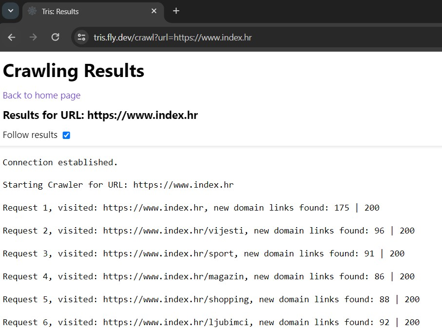

# Tris - Simple Spider Scraper

Simple Spider Scraper or _Tris_ is a Node.js CLI tool which is by its core feature a web scraper (link spider) that allows you to recursively crawl a website and collect links within the specified depth. It provides various customization options to tailor the scraping process according to your needs.

Whether you're a developer, SEO professional, or data enthusiast, Tris provides a simple yet powerful tool to gather valuable insights from websites.



## Who Can Benefit?

### Developers

Tris is ideal for developers who need a quick and reliable way to extract links from a website, whether for indexing purposes, link analysis, or content mapping.

### SEO Professionals

SEO professionals can leverage Tris to gather valuable data about a website's structure, internal linking, and potential SEO opportunities.

### Data Enthusiasts

Data enthusiasts seeking to explore and analyze the structure of websites can use Tris to collect link data and gain insights into a website's content hierarchy.

## Features

- **Customizable Settings**: Configure the scraper with various settings using environment variables.
- **Timeout Handling**: Specify the timeout in milliseconds for each request.
- **Path Depth Limitation**: Set the maximum depth of paths to be scraped.
- **Randomized User Agents**: Provide a list of custom user-agent headers that are randomized between requests.
- **Skip Words**: Skip links that contain specified skip words.
- **Sorting Output**: Optionally sort the output file lines in ascending order.
- **Delay Between Requests**: Introduce a delay between requests to avoid overloading the server.
- **HTTP Status Codes**: Optionally include HTTP status codes in the output file.
- **Include/Exclude Paths**: Filter links based on specified path patterns.
- **Trim Ending Slash**: Control whether trailing slashes are removed from URLs.
- **Exclude Query String and Fragment**: Optionally exclude query strings and fragments from URLs.
- **Limit amount of requests**: Optionally limit the total amount of web requests to be sent.

## Setup

Prerequisite is NodeJS >= v14.17 (check out related [package.json](./package.json)).

1. Clone the repository:

```bash
git clone https://github.com/vmandic/tris-simple-spider-scraper.git
```

2. Yarn install:

```bash
yarn install
```

## Run

Before running you can set up you .env file first by looking at the [.env.example](./.env.example) file to set up the scraper configuration options.

### From CLI

The results are printed back directly to the terminal standard output.

```bash
yarn start https:///www.github.com
```

### As HTTP server

By default the web app will be served on :8080, you can specify your own port as first parameter.
The following example will serve on the default 8080 port:

```bash
yarn serve
```

The server works by opening a web socket connection on the given web server port +1 (ie. if you selected port 7777 then the socket will be on 7778). The web socket is used to transmit live scraping results back to the web page so you can see results as they come back.

Start on port 7777 by explicitly specifying it:

```bash
yarn serve 7777 
```

After starting the web server navigate to:<br>`/scrape?url={specify valid URL to start scraping from here}`

## Debugging

You can debug the app in either CLI or web server run mode using the configuration in [`./vscode/launch.json`](./.vscode/launch.json). and vscode as your IDE and debugging tool.

## Configuration (Environment Variables)

Setup the .env file by copying [.env.example](./.env.example):

```bash
cp .env.example .env
```

- `WEB_REQUESTS_LIMIT`: Set to limit the amount of requests (default: unlimited ie. 0).
- `TIMEOUT_MS`: Set the timeout in milliseconds (default: 10ms).
- `PATH_DEPTH`: Set the path depth limit (default: 3).
- `USER_AGENTS`: Provide a list of custom user-agent headers (comma-delimited).
- `USE_RANDOM_AGENTS_COUNT`: Overrides USER_AGENTS if specified, generates N random UAs, default 0.
- `SKIP_WORDS`: Specify skip words to skip links (comma-delimited).
- `SORT_OUTPUT`: Set to "true" to sort output lines in ascending order.
- `DELAY_MS`: Introduce a delay between requests (default: 0).
- `INCLUDE_PATH`: Specify a path pattern to include only matching paths.
- `OUTPUT_HTTP_CODE`: Set to "true" to include HTTP status codes in the output.
- `EXCLUDE_QUERY_STRING`: Set to "true" to exclude query strings from URLs (default: false).
- `EXCLUDE_FRAGMENT`: Set to "true" to exclude fragments from URLs (default: false).

## Author

Vedran Mandić

Feel free to modify or extend it further based on your preferences!

## Why Tris?

Tris stands out as a simple yet effective solution for web scraping, providing a balance between customization and ease of use. As said in the begging of this document, whether you're a developer, SEO professional, or data enthusiast, Tris empowers you to gather valuable insights from websites with minimal setup and maximum flexibility.

Start exploring the web with Tris today!

## License

This project is licensed under the [ISC License](LICENSE) - see the [LICENSE](LICENSE) file for details.
